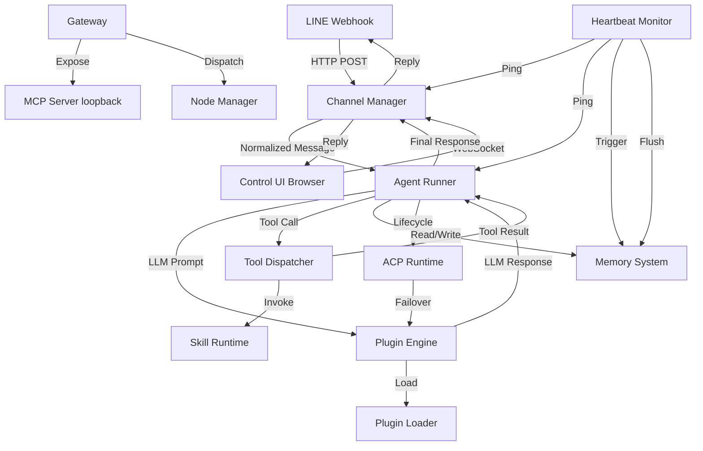
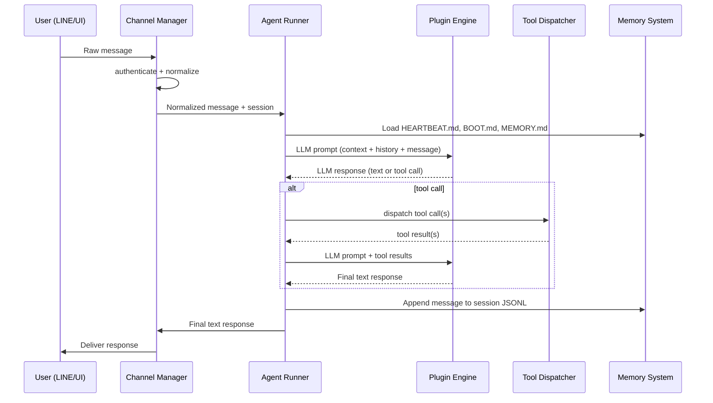
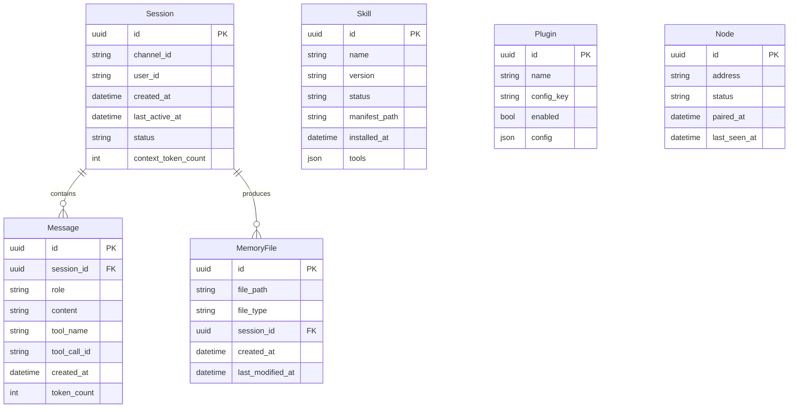

# System Design Document (SDD)
## AAOS ??Autonomous Agent Orchestration System
Version: v1.0 | Status: Pre-MVP | Generated by: /docgenerate

---

## Section 1 ??Overview

AAOS is a persistent, self-hosted personal AI assistant gateway. It is a TypeScript Node.js process running in Docker that unifies messaging channels (LINE webhook, browser Control UI via WebSocket), LLM providers (Anthropic, Ollama, Google, Browser), an npm-based skill system, and file-based memory storage under a single orchestration engine. All user messages are authenticated, normalized, routed to sessions, processed by the Agent Runner, dispatched through the Tool Dispatcher, and responded to via the originating channel.

- **Tech Stack**: TypeScript, Express.js, `ws`, Jest, npm, Docker (Linux)
- **Storage**: File system only (`~/.aaos/`) ??JSONL logs + Markdown memory
- **Auth**: JWT (device identity) + HMAC-SHA256 (LINE webhook signature)
- **Traces to**: Contract Section 1

---

## Section 2 ??Architecture

### 2.1 Component Overview



### 2.2 Message Flow (WF-01)



### 2.3 Entity Relationship



---

## Section 3 ??Components

> All components derive from docs/FEATURE_TREE.md. Every function has est. LOC ??50.

---

### Component: ChannelManager
**Owner file**: `src/channel/channel_manager.ts`
**Traces to**: FR-001, FR-002, FR-004, FR-005, FR-011, FR-017, FR-020

#### FN-001.1.1.1 `io_receive_line_webhook`
- Signature: `io_receive_line_webhook(req: Request, res: Response): Promise<void>`
- Responsibility: Reads raw LINE webhook POST body and immediately sends HTTP 200
- Dependencies: Express.js Request/Response
- Error handling: Throws `WebhookParseError` on malformed body
- Est. LOC: 20 | Traces to: FR-001, AC-001

#### FN-001.1.1.2 `validate_line_signature`
- Signature: `validate_line_signature(body: string, signature: string, secret: string): boolean`
- Responsibility: Verifies LINE HMAC-SHA256 signature against channel secret
- Dependencies: Node.js `crypto`
- Error handling: Returns `false` on missing/invalid signature; caller rejects with 401
- Est. LOC: 25 | Traces to: FR-003, AC-002, EC-001

#### FN-001.1.2.1 `transform_line_event_to_message`
- Signature: `transform_line_event_to_message(event: LineEvent): InternalMessage`
- Responsibility: Converts a LINE event object to the internal message format
- Dependencies: InternalMessage type
- Error handling: Throws `NormalizationError` if required fields missing
- Est. LOC: 30 | Traces to: FR-004, AC-003, EC-002

#### FN-001.1.2.2 `validate_line_event_fields`
- Signature: `validate_line_event_fields(event: LineEvent): ValidationResult`
- Responsibility: Validates that all required LINE event fields are present
- Dependencies: Zod-style schema (internal)
- Error handling: Returns `{ valid: false, errors: string[] }` on failure
- Est. LOC: 20 | Traces to: FR-004, AC-003

#### FN-001.2.1.1 `io_ack_line_webhook`
- Signature: `io_ack_line_webhook(res: Response): void`
- Responsibility: Sends HTTP 200 response immediately to satisfy LINE 3s requirement
- Dependencies: Express.js Response
- Error handling: Logs if response already sent
- Est. LOC: 10 | Traces to: FR-001, NFR-001, BR-002

#### FN-001.2.1.2 `enqueue_line_message_for_processing`
- Signature: `enqueue_line_message_for_processing(message: InternalMessage): void`
- Responsibility: Places normalized message onto the async processing queue
- Dependencies: Internal event bus
- Error handling: Logs `EnqueueError` on failure
- Est. LOC: 15 | Traces to: FR-005

#### FN-002.1.1.1 `io_accept_ws_connection`
- Signature: `io_accept_ws_connection(ws: WebSocket, req: Request): void`
- Responsibility: Accepts incoming WebSocket connection and initiates auth check
- Dependencies: `ws` library
- Error handling: Closes socket with 401 if auth fails
- Est. LOC: 20 | Traces to: FR-002, FR-032

#### FN-002.1.1.2 `validate_ws_device_token`
- Signature: `validate_ws_device_token(token: string): DeviceTokenPayload | null`
- Responsibility: Verifies JWT device identity token; returns payload or null
- Dependencies: `jsonwebtoken`
- Error handling: Returns null on expired/invalid; caller closes socket
- Est. LOC: 25 | Traces to: FR-032, AC-011, AC-012, EC-010

#### FN-002.2.1.1 `io_read_ws_message`
- Signature: `io_read_ws_message(raw: string): WsMessage | null`
- Responsibility: Parses raw WebSocket frame string into WsMessage object
- Dependencies: JSON.parse
- Error handling: Returns null on parse failure; logs error
- Est. LOC: 15 | Traces to: FR-033, EC-002

#### FN-002.2.1.2 `validate_ws_message_schema`
- Signature: `validate_ws_message_schema(msg: unknown): ValidationResult`
- Responsibility: Validates request_id, type, and content fields are present
- Dependencies: Internal schema validator
- Error handling: Returns `{ valid: false, errors }` on failure
- Est. LOC: 20 | Traces to: FR-033, AC-013

#### FN-002.2.1.3 `route_ws_message_to_session`
- Signature: `route_ws_message_to_session(msg: WsMessage, clientId: string): void`
- Responsibility: Routes validated WS message to the correct session context
- Dependencies: SessionManager
- Error handling: Logs `RoutingError` if session not found
- Est. LOC: 20 | Traces to: FR-005

#### FN-002.3.1.1 `io_push_ws_event`
- Signature: `io_push_ws_event(clients: WebSocket[], event: WsEvent): void`
- Responsibility: Broadcasts a server-push event to all connected WS clients
- Dependencies: `ws` library
- Error handling: Catches and logs send errors per client; continues to others
- Est. LOC: 15 | Traces to: FR-034, AC-014

#### FN-002.3.1.2 `io_handle_ws_disconnect`
- Signature: `io_handle_ws_disconnect(clientId: string): void`
- Responsibility: Cleans up client state when a WebSocket disconnects
- Dependencies: ClientRegistry
- Error handling: Logs if client not found in registry
- Est. LOC: 20 | Traces to: FR-002, AC-015, EC-009

#### FN-005.1.1.1 `get_or_create_session`
- Signature: `get_or_create_session(channelId: string, userId: string): Session`
- Responsibility: Returns existing active session or creates a new one
- Dependencies: SessionStore
- Error handling: Throws `SessionStoreError` on I/O failure
- Est. LOC: 30 | Traces to: FR-005, AC-004

#### FN-005.1.1.2 `update_session_last_active`
- Signature: `update_session_last_active(sessionId: string): void`
- Responsibility: Updates the last_active_at timestamp on a session
- Dependencies: SessionStore
- Error handling: Logs on failure; non-blocking
- Est. LOC: 10 | Traces to: FR-005

#### FN-005.2.1.1 `route_message_to_session`
- Signature: `route_message_to_session(message: InternalMessage): Session`
- Responsibility: Resolves the correct session for an incoming message and enqueues it
- Dependencies: SessionManager, get_or_create_session
- Error handling: Throws `RoutingError` on unresolvable channel
- Est. LOC: 20 | Traces to: FR-005, AC-004, EC-002

#### FN-011.1.1.1 `resolve_delivery_channel`
- Signature: `resolve_delivery_channel(session: Session): ChannelAdapter`
- Responsibility: Returns the correct channel adapter based on session's channel_id
- Dependencies: ChannelAdapterRegistry
- Error handling: Throws `UnknownChannelError` if channel not found
- Est. LOC: 15 | Traces to: FR-011

#### FN-011.1.1.2 `io_deliver_to_line`
- Signature: `io_deliver_to_line(userId: string, text: string, token: string): Promise<void>`
- Responsibility: Sends a reply message to LINE using the reply token
- Dependencies: LINE Messaging API client
- Error handling: Throws `LineDeliveryError` on API failure
- Est. LOC: 25 | Traces to: FR-011, FR-001

#### FN-011.1.1.3 `io_deliver_to_ws_client`
- Signature: `io_deliver_to_ws_client(clientId: string, response: WsResponse): void`
- Responsibility: Sends the final response to the Control UI WebSocket client
- Dependencies: ClientRegistry, ws
- Error handling: Logs if client disconnected; no re-delivery
- Est. LOC: 20 | Traces to: FR-011, FR-002, AC-015, EC-009

---

### Component: AuthManager
**Owner file**: `src/auth/auth_manager.ts`
**Traces to**: FR-003, FR-032

#### FN-003.2.1.1 `generate_device_jwt`
- Signature: `generate_device_jwt(deviceId: string, secret: string): string`
- Responsibility: Issues a signed JWT for a paired device identity
- Dependencies: `jsonwebtoken`
- Error handling: Throws `JwtSignError` on signing failure
- Est. LOC: 20 | Traces to: FR-032

#### FN-003.2.1.2 `validate_device_jwt`
- Signature: `validate_device_jwt(token: string, secret: string): DevicePayload | null`
- Responsibility: Verifies and decodes a device JWT; returns null if invalid/expired
- Dependencies: `jsonwebtoken`
- Error handling: Catches `JsonWebTokenError`, `TokenExpiredError`; returns null
- Est. LOC: 25 | Traces to: FR-032, AC-011, AC-012, EC-010

#### FN-003.3.1.1 `validate_admin_role`
- Signature: `validate_admin_role(payload: DevicePayload): boolean`
- Responsibility: Checks that the decoded token payload has ROLE-02 (admin) role
- Dependencies: DevicePayload type
- Error handling: Returns false on missing or wrong role
- Est. LOC: 15 | Traces to: FR-003, BR-001

#### FN-004.1.1.1 `validate_internal_message`
- Signature: `validate_internal_message(msg: unknown): ValidationResult`
- Responsibility: Validates that an internal message has all required fields and types
- Dependencies: Internal schema validator
- Error handling: Returns `{ valid: false, errors }` on failure; caller drops message
- Est. LOC: 20 | Traces to: FR-004, AC-003, EC-002

#### FN-004.1.1.2 `transform_to_internal_message`
- Signature: `transform_to_internal_message(raw: RawMessage, channel: string): InternalMessage`
- Responsibility: Maps a raw channel message to the internal message format
- Dependencies: InternalMessage type, channel enum
- Error handling: Throws `TransformError` if mapping fails
- Est. LOC: 25 | Traces to: FR-004

---

### Component: AgentRunner
**Owner file**: `src/agent/agent_runner.ts`
**Traces to**: FR-006, FR-007, FR-008, FR-010, FR-027

#### FN-006.1.1.1 `io_read_context_file`
- Signature: `io_read_context_file(filePath: string): string | null`
- Responsibility: Reads a workspace context file from disk; returns null if missing
- Dependencies: Node.js `fs`
- Error handling: Catches `ENOENT`; returns null; logs warning
- Est. LOC: 20 | Traces to: FR-006, FR-024, AC-005, AC-006, EC-013

#### FN-006.1.1.2 `validate_context_file_exists`
- Signature: `validate_context_file_exists(filePath: string): boolean`
- Responsibility: Checks if a required context file exists on disk
- Dependencies: Node.js `fs`
- Error handling: Returns false if stat fails; logs warning
- Est. LOC: 15 | Traces to: FR-006, EC-013

#### FN-006.2.1.1 `build_system_context_prefix`
- Signature: `build_system_context_prefix(heartbeat: string | null, boot: string | null, memory: string | null): string`
- Responsibility: Concatenates available context files into a single system prefix string
- Dependencies: None
- Error handling: Skips null files; logs which were missing
- Est. LOC: 25 | Traces to: FR-006, AC-005, AC-006

#### FN-006.2.1.2 `assemble_llm_prompt`
- Signature: `assemble_llm_prompt(systemPrefix: string, history: Message[], newMessage: InternalMessage): LlmPrompt`
- Responsibility: Combines system prefix, conversation history, and new message into LLM prompt
- Dependencies: LlmPrompt type, Message type
- Error handling: Throws `PromptAssemblyError` on type mismatch
- Est. LOC: 30 | Traces to: FR-006, FR-007, FR-008

#### FN-007.1.1.1 `extract_text_response`
- Signature: `extract_text_response(llmResponse: LlmResponse): string | null`
- Responsibility: Extracts the plain text content from an LLM response
- Dependencies: LlmResponse type
- Error handling: Returns null if response has no text content
- Est. LOC: 15 | Traces to: FR-007, AC-007

#### FN-007.1.1.2 `deliver_text_response_to_channel`
- Signature: `deliver_text_response_to_channel(session: Session, text: string): Promise<void>`
- Responsibility: Routes final text response to the correct channel delivery function
- Dependencies: resolve_delivery_channel, io_deliver_to_line, io_deliver_to_ws_client
- Error handling: Throws `DeliveryError` on channel failure
- Est. LOC: 20 | Traces to: FR-007, FR-011, AC-007

#### FN-008.1.1.1 `parse_tool_calls_from_llm_response`
- Signature: `parse_tool_calls_from_llm_response(llmResponse: LlmResponse): ToolCall[]`
- Responsibility: Extracts all tool call objects from an LLM response
- Dependencies: LlmResponse type, ToolCall type
- Error handling: Returns empty array if no tool calls present
- Est. LOC: 25 | Traces to: FR-008, AC-008, AC-010

#### FN-008.1.1.2 `validate_tool_call_schema`
- Signature: `validate_tool_call_schema(toolCall: unknown): ValidationResult`
- Responsibility: Validates that a tool call has required name and arguments fields
- Dependencies: Internal schema validator
- Error handling: Returns `{ valid: false, errors }` on failure
- Est. LOC: 20 | Traces to: FR-008, AC-008, EC-004

#### FN-008.2.1.1 `dispatch_tool_calls_parallel`
- Signature: `dispatch_tool_calls_parallel(toolCalls: ToolCall[]): Promise<ToolResult[]>`
- Responsibility: Dispatches all tool calls concurrently using Promise.all
- Dependencies: execute_tool
- Error handling: Catches per-call errors; returns error results for failed calls
- Est. LOC: 30 | Traces to: FR-008, FR-009, AC-010, EC-015

#### FN-008.2.1.2 `aggregate_tool_results`
- Signature: `aggregate_tool_results(results: ToolResult[]): ToolResultMap`
- Responsibility: Maps tool results by tool_call_id for injection into LLM context
- Dependencies: ToolResult type
- Error handling: Logs if any result has a missing tool_call_id
- Est. LOC: 20 | Traces to: FR-010, AC-010, EC-015

#### FN-010.1.1.1 `build_tool_result_message`
- Signature: `build_tool_result_message(result: ToolResult): Message`
- Responsibility: Wraps a tool result in the LLM tool result message format
- Dependencies: Message type
- Error handling: Throws `MessageBuildError` on missing required fields
- Est. LOC: 20 | Traces to: FR-010

#### FN-010.1.1.2 `inject_tool_results_into_context`
- Signature: `inject_tool_results_into_context(history: Message[], results: ToolResult[]): Message[]`
- Responsibility: Appends tool result messages to conversation history
- Dependencies: build_tool_result_message
- Error handling: Throws if results array is empty when tool calls were made
- Est. LOC: 20 | Traces to: FR-010

#### FN-027.1.1.1 `start_agent_run`
- Signature: `start_agent_run(session: Session, message: InternalMessage): Promise<AgentRunResult>`
- Responsibility: Initiates the full agent processing loop for a session message
- Dependencies: assemble_llm_prompt, Plugin Engine, Tool Dispatcher
- Error handling: Catches all run errors; delegates to ACP failover
- Est. LOC: 30 | Traces to: FR-027, AC-042

#### FN-027.1.1.2 `pause_agent_run`
- Signature: `pause_agent_run(runId: string): void`
- Responsibility: Sets agent run state to paused
- Dependencies: RunStateStore
- Error handling: Logs if runId not found
- Est. LOC: 15 | Traces to: FR-027

#### FN-027.1.1.3 `resume_agent_run`
- Signature: `resume_agent_run(runId: string): void`
- Responsibility: Resumes a paused agent run from its last checkpoint
- Dependencies: RunStateStore
- Error handling: Logs if runId not found or not in paused state
- Est. LOC: 15 | Traces to: FR-027

#### FN-027.1.1.4 `cancel_agent_run`
- Signature: `cancel_agent_run(runId: string): void`
- Responsibility: Cancels an active or paused agent run
- Dependencies: RunStateStore
- Error handling: Logs if runId not found
- Est. LOC: 15 | Traces to: FR-027

#### FN-027.2.1.1 `chain_agent_run_stages`
- Signature: `chain_agent_run_stages(stages: AgentStage[]): Promise<AgentRunResult>`
- Responsibility: Executes stages sequentially, piping output of each to the next
- Dependencies: transform_stage_output_to_next_input
- Error handling: Stops chain and returns error on any stage failure
- Est. LOC: 30 | Traces to: FR-027, AC-045

#### FN-027.2.1.2 `transform_stage_output_to_next_input`
- Signature: `transform_stage_output_to_next_input(output: StageOutput): StageInput`
- Responsibility: Converts one stage's output format into the next stage's input format
- Dependencies: StageOutput, StageInput types
- Error handling: Throws `StageTransformError` on incompatible types
- Est. LOC: 20 | Traces to: FR-027, AC-045

---

### Component: AcpRuntime
**Owner file**: `src/acp/acp_runtime.ts`
**Traces to**: FR-027, FR-028

#### FN-028.1.1.1 `execute_with_acp_retry`
- Signature: `execute_with_acp_retry(fn: () => Promise<LlmResponse>, maxRetries: number): Promise<LlmResponse>`
- Responsibility: Executes an LLM call with up to 3 retry attempts before surfacing error
- Dependencies: select_next_available_provider
- Error handling: Throws `AcpExhaustionError` after max retries exceeded
- Est. LOC: 35 | Traces to: FR-028, AC-043, AC-044, EC-003, BR-005

#### FN-028.1.1.2 `select_next_available_provider`
- Signature: `select_next_available_provider(attempted: string[]): Plugin | null`
- Responsibility: Returns next enabled LLM provider not already attempted
- Dependencies: PluginRegistry
- Error handling: Returns null if all providers exhausted
- Est. LOC: 25 | Traces to: FR-028, EC-003, EC-016

#### FN-028.1.1.3 `validate_provider_available`
- Signature: `validate_provider_available(plugin: Plugin): boolean`
- Responsibility: Checks that a provider plugin is enabled and configured
- Dependencies: Plugin entity
- Error handling: Returns false if disabled or config missing
- Est. LOC: 15 | Traces to: FR-028, EC-016

---

### Component: ToolDispatcher
**Owner file**: `src/tools/tool_dispatcher.ts`
**Traces to**: FR-009, FR-010, FR-015

#### FN-009.1.1.1 `register_tool`
- Signature: `register_tool(name: string, handler: ToolHandler): void`
- Responsibility: Adds a tool name and handler to the tool registry
- Dependencies: ToolRegistry
- Error handling: Logs warning if tool name already registered (overwrites)
- Est. LOC: 15 | Traces to: FR-009, FR-015

#### FN-009.1.1.2 `lookup_tool_handler`
- Signature: `lookup_tool_handler(name: string): ToolHandler | null`
- Responsibility: Returns the handler function for a given tool name, or null
- Dependencies: ToolRegistry
- Error handling: Returns null if not found; caller handles EC-004
- Est. LOC: 15 | Traces to: FR-009, EC-004

#### FN-009.1.1.3 `validate_tool_exists`
- Signature: `validate_tool_exists(name: string): boolean`
- Responsibility: Checks if a tool name exists in the registry
- Dependencies: ToolRegistry
- Error handling: Returns false on missing entry
- Est. LOC: 10 | Traces to: FR-009, EC-004

#### FN-009.2.1.1 `execute_tool`
- Signature: `execute_tool(toolCall: ToolCall): Promise<ToolResult>`
- Responsibility: Invokes the registered handler for a tool call and returns the result
- Dependencies: lookup_tool_handler, io_invoke_skill_handler
- Error handling: Returns error result if tool not found (EC-004) or handler throws
- Est. LOC: 30 | Traces to: FR-009, AC-008, AC-009, EC-004

#### FN-009.2.1.2 `io_invoke_skill_handler`
- Signature: `io_invoke_skill_handler(handler: ToolHandler, args: ToolArgs): Promise<ToolResult>`
- Responsibility: Calls the skill's exported handler function with the provided arguments
- Dependencies: Node.js module system
- Error handling: Catches and wraps all skill errors as ToolResult errors
- Est. LOC: 20 | Traces to: FR-009, FR-015

---

### Component: SkillManager
**Owner file**: `src/skills/skill_manager.ts`
**Traces to**: FR-012, FR-013, FR-014, FR-015, FR-035, FR-036

#### FN-012.1.1.1 `io_receive_skill_install_request`
- Signature: `io_receive_skill_install_request(req: Request, res: Response): Promise<void>`
- Responsibility: Handles POST /skills/install; validates and delegates to install pipeline
- Dependencies: Express.js, validate_skill_not_already_installed
- Error handling: Returns 400/409 on validation failure
- Est. LOC: 15 | Traces to: FR-012, AC-016, AC-017

#### FN-012.1.1.2 `validate_skill_not_already_installed`
- Signature: `validate_skill_not_already_installed(packageName: string): boolean`
- Responsibility: Checks SkillStore for an existing installed skill with the same name
- Dependencies: SkillStore
- Error handling: Returns false if duplicate found; caller returns 409
- Est. LOC: 15 | Traces to: FR-012, AC-017, EC-006

#### FN-012.2.1.1 `io_run_npm_install`
- Signature: `io_run_npm_install(packageName: string, targetDir: string): Promise<NpmResult>`
- Responsibility: Spawns npm install as a child process and captures stdout/stderr
- Dependencies: Node.js `child_process`
- Error handling: Returns `{ success: false, stderr }` on non-zero exit code
- Est. LOC: 30 | Traces to: FR-014, AC-018, EC-005

#### FN-012.2.1.2 `validate_npm_install_result`
- Signature: `validate_npm_install_result(result: NpmResult): boolean`
- Responsibility: Checks npm install result for success; extracts error message if failed
- Dependencies: NpmResult type
- Error handling: Returns false on failure; caller surfaces error to CLI
- Est. LOC: 20 | Traces to: FR-014, EC-005

#### FN-013.1.1.1 `io_read_skill_manifest`
- Signature: `io_read_skill_manifest(manifestPath: string): string | null`
- Responsibility: Reads raw manifest file content from disk
- Dependencies: Node.js `fs`
- Error handling: Returns null on read failure; logs error
- Est. LOC: 20 | Traces to: FR-013

#### FN-013.1.1.2 `parse_skill_manifest_yaml`
- Signature: `parse_skill_manifest_yaml(raw: string): SkillManifest | null`
- Responsibility: Parses YAML frontmatter from manifest file into structured object
- Dependencies: `js-yaml`
- Error handling: Returns null on parse error; logs YAML syntax issue
- Est. LOC: 25 | Traces to: FR-013

#### FN-013.1.1.3 `validate_manifest_schema`
- Signature: `validate_manifest_schema(manifest: unknown): ValidationResult`
- Responsibility: Validates required manifest fields including version pin (NFR-012)
- Dependencies: Internal schema validator
- Error handling: Returns `{ valid: false, errors }` on missing version or fields
- Est. LOC: 20 | Traces to: FR-013, AC-019, NFR-012

#### FN-014.1.1.1 `extract_manifest_dependencies`
- Signature: `extract_manifest_dependencies(manifest: SkillManifest): string[]`
- Responsibility: Extracts the list of npm dependency names from the manifest
- Dependencies: SkillManifest type
- Error handling: Returns empty array if no dependencies declared
- Est. LOC: 15 | Traces to: FR-014

#### FN-014.1.1.2 `io_install_manifest_dependencies`
- Signature: `io_install_manifest_dependencies(deps: string[], targetDir: string): Promise<NpmResult>`
- Responsibility: Runs npm install for all declared manifest dependencies
- Dependencies: io_run_npm_install
- Error handling: Returns first failure result; logs all failures
- Est. LOC: 25 | Traces to: FR-014, AC-018, EC-005

#### FN-015.1.1.1 `register_skill_tools`
- Signature: `register_skill_tools(skill: Skill): void`
- Responsibility: Registers all tool names from an installed skill into the Tool Dispatcher
- Dependencies: ToolDispatcher.register_tool
- Error handling: Logs if tool registration fails for any tool
- Est. LOC: 25 | Traces to: FR-015, AC-020, BR-004

#### FN-015.1.1.2 `validate_skill_enabled`
- Signature: `validate_skill_enabled(skill: Skill): boolean`
- Responsibility: Checks that a skill's status is "enabled" before tool registration
- Dependencies: Skill entity
- Error handling: Returns false if status is "disabled"
- Est. LOC: 10 | Traces to: FR-015, BR-004, EC-016

#### FN-015.2.1.1 `deregister_skill_tools`
- Signature: `deregister_skill_tools(skill: Skill): void`
- Responsibility: Removes all tool names for a disabled skill from the Tool Dispatcher
- Dependencies: ToolRegistry
- Error handling: Logs if tool not found during deregistration
- Est. LOC: 20 | Traces to: FR-036, AC-021, BR-004

#### FN-035.1.1.1 `io_list_installed_skills`
- Signature: `io_list_installed_skills(): Skill[]`
- Responsibility: Returns all skills from the SkillStore
- Dependencies: SkillStore
- Error handling: Returns empty array on store read failure; logs error
- Est. LOC: 20 | Traces to: FR-035, AC-022

#### FN-036.1.1.1 `io_disable_skill`
- Signature: `io_disable_skill(skillId: string): Skill`
- Responsibility: Sets skill status to "disabled" and triggers tool deregistration
- Dependencies: SkillStore, deregister_skill_tools
- Error handling: Throws `SkillNotFoundError` if ID not found
- Est. LOC: 20 | Traces to: FR-036, AC-023

#### FN-036.1.1.2 `validate_skill_exists_and_enabled`
- Signature: `validate_skill_exists_and_enabled(skillId: string): Skill | null`
- Responsibility: Verifies skill exists and is currently enabled before disable operation
- Dependencies: SkillStore
- Error handling: Returns null if not found or already disabled; caller returns 404/409
- Est. LOC: 15 | Traces to: FR-036, EC-006

---

### Component: HeartbeatMonitor
**Owner file**: `src/heartbeat/heartbeat_monitor.ts`
**Traces to**: FR-016, FR-017, FR-018, FR-019, FR-020, FR-037

#### FN-016.1.1.1 `schedule_heartbeat`
- Signature: `schedule_heartbeat(intervalMs: number, gracePeriodMs: number): NodeJS.Timer`
- Responsibility: Schedules the heartbeat function to run every intervalMs after grace period
- Dependencies: Node.js `setInterval`, `setTimeout`
- Error handling: Logs if timer creation fails
- Est. LOC: 15 | Traces to: FR-016, NFR-007

#### FN-016.1.1.2 `ping_all_subsystems`
- Signature: `ping_all_subsystems(subsystems: Subsystem[]): Promise<PingResult[]>`
- Responsibility: Sends internal health ping to each registered subsystem concurrently
- Dependencies: Subsystem interface
- Error handling: Catches per-subsystem errors; marks as degraded on timeout
- Est. LOC: 25 | Traces to: FR-016, AC-024, AC-025, EC-012

#### FN-016.1.1.3 `update_subsystem_health_status`
- Signature: `update_subsystem_health_status(results: PingResult[]): void`
- Responsibility: Updates the health status store based on ping results
- Dependencies: HealthStatusStore
- Error handling: Logs if store update fails
- Est. LOC: 20 | Traces to: FR-016, AC-024, AC-025

#### FN-017.1.1.1 `send_channel_keepalive_frames`
- Signature: `send_channel_keepalive_frames(connections: ChannelConnection[]): void`
- Responsibility: Sends keepalive/ping frames to all active channel connections
- Dependencies: ChannelAdapterRegistry
- Error handling: Catches per-connection errors; marks failed connections
- Est. LOC: 20 | Traces to: FR-017, AC-026

#### FN-017.1.1.2 `validate_channel_still_connected`
- Signature: `validate_channel_still_connected(connection: ChannelConnection): boolean`
- Responsibility: Checks if a channel connection is still in an active state
- Dependencies: ChannelConnection type
- Error handling: Returns false on any error state
- Est. LOC: 15 | Traces to: FR-017, EC-012

#### FN-018.1.1.1 `check_compaction_threshold`
- Signature: `check_compaction_threshold(session: Session, maxTokens: number): boolean`
- Responsibility: Returns true if session token count exceeds 80% of maxTokens
- Dependencies: Session entity
- Error handling: Returns false on invalid inputs; logs warning
- Est. LOC: 15 | Traces to: FR-018, AC-030, BR-003

#### FN-018.1.1.2 `trigger_compaction_if_needed`
- Signature: `trigger_compaction_if_needed(session: Session, maxTokens: number): Promise<void>`
- Responsibility: Evaluates threshold and calls compaction orchestrator if needed
- Dependencies: check_compaction_threshold, orchestrate_context_compaction
- Error handling: Logs if compaction fails; non-blocking
- Est. LOC: 20 | Traces to: FR-018, FR-021, AC-030, BR-003

#### FN-019.1.1.1 `flush_session_logs`
- Signature: `flush_session_logs(sessions: Session[]): Promise<void>`
- Responsibility: Triggers JSONL log flush for all active sessions
- Dependencies: io_write_session_jsonl
- Error handling: Logs per-session flush errors; continues to others
- Est. LOC: 20 | Traces to: FR-019, AC-029, BR-008

#### FN-019.1.1.2 `io_write_session_jsonl`
- Signature: `io_write_session_jsonl(sessionId: string, messages: Message[]): Promise<void>`
- Responsibility: Writes session messages as JSONL to `~/.aaos/` session log file
- Dependencies: Node.js `fs`
- Error handling: Throws `LogWriteError` on failure; caller logs and continues
- Est. LOC: 25 | Traces to: FR-019, FR-023, AC-029, EC-008

#### FN-020.1.1.1 `monitor_channel_connect_grace`
- Signature: `monitor_channel_connect_grace(channel: ChannelConnection, graceMs: number): void`
- Responsibility: Starts a timer; marks channel degraded if not connected within graceMs
- Dependencies: mark_channel_degraded, setTimeout
- Error handling: Clears timer if channel connects before grace expires
- Est. LOC: 25 | Traces to: FR-020, AC-027, BR-006

#### FN-020.1.1.2 `mark_channel_degraded`
- Signature: `mark_channel_degraded(channelId: string): void`
- Responsibility: Sets channel status to "degraded" in the channel registry (not terminated)
- Dependencies: ChannelRegistry
- Error handling: Logs if channel not found
- Est. LOC: 15 | Traces to: FR-020, AC-027, BR-006

#### FN-037.1.1.1 `apply_startup_grace_period`
- Signature: `apply_startup_grace_period(graceMs: number, onComplete: () => void): void`
- Responsibility: Delays health monitoring activation by graceMs after startup
- Dependencies: setTimeout
- Error handling: None ??pure timer
- Est. LOC: 15 | Traces to: FR-037, AC-028

---

### Component: MemorySystem
**Owner file**: `src/memory/memory_system.ts`
**Traces to**: FR-021, FR-022, FR-023, FR-024, FR-025

#### FN-021.1.1.1 `orchestrate_context_compaction`
- Signature: `orchestrate_context_compaction(session: Session): Promise<void>`
- Responsibility: Selects messages for compaction, queues LLM calls, and triggers summarization
- Dependencies: select_messages_for_compaction, queue_llm_call_during_compaction, summarize_messages_via_llm
- Error handling: Logs if compaction fails; retains raw history on failure
- Est. LOC: 35 | Traces to: FR-021, AC-031, AC-032, EC-007, BR-010

#### FN-021.1.1.2 `select_messages_for_compaction`
- Signature: `select_messages_for_compaction(messages: Message[], keepRecent: number): CompactionSet`
- Responsibility: Separates messages into recent (preserved) and older (to summarize)
- Dependencies: Message type
- Error handling: Returns all messages as "recent" if keepRecent >= total count
- Est. LOC: 25 | Traces to: FR-021, AC-032, BR-010

#### FN-021.1.1.3 `queue_llm_call_during_compaction`
- Signature: `queue_llm_call_during_compaction(sessionId: string, call: () => Promise<LlmResponse>): Promise<LlmResponse>`
- Responsibility: Queues an LLM call until compaction for that session completes
- Dependencies: CompactionStateStore
- Error handling: Rejects with timeout error if queue waits exceed threshold
- Est. LOC: 20 | Traces to: FR-021, AC-031, EC-007

#### FN-022.1.1.1 `summarize_messages_via_llm`
- Signature: `summarize_messages_via_llm(messages: Message[], provider: Plugin): Promise<string>`
- Responsibility: Sends older messages to LLM for summarization and returns summary text
- Dependencies: Plugin Engine, execute_with_acp_retry
- Error handling: Throws `CompactionError` on LLM failure; caller retains raw history
- Est. LOC: 30 | Traces to: FR-022, AC-033

#### FN-022.1.1.2 `io_save_compaction_summary`
- Signature: `io_save_compaction_summary(sessionId: string, summary: string): Promise<void>`
- Responsibility: Writes the compaction summary to the memory directory
- Dependencies: Node.js `fs`
- Error handling: Throws `MemoryWriteError` on failure; logs path and reason
- Est. LOC: 20 | Traces to: FR-022, FR-023, AC-033, EC-008

#### FN-023.1.1.1 `io_append_message_to_session_log`
- Signature: `io_append_message_to_session_log(sessionId: string, message: Message): Promise<void>`
- Responsibility: Appends a single message as a JSONL line to the session log file
- Dependencies: Node.js `fs` (append)
- Error handling: Throws `LogWriteError` on failure
- Est. LOC: 20 | Traces to: FR-023, AC-034, EC-008

#### FN-023.1.1.2 `validate_session_log_writable`
- Signature: `validate_session_log_writable(logPath: string): boolean`
- Responsibility: Checks that the session log file path is writable
- Dependencies: Node.js `fs`
- Error handling: Returns false on access failure; logs path and reason
- Est. LOC: 15 | Traces to: FR-023, EC-008

#### FN-023.1.1.3 `io_initialize_session_log_file`
- Signature: `io_initialize_session_log_file(sessionId: string): Promise<string>`
- Responsibility: Creates a new JSONL session log file and returns its path
- Dependencies: Node.js `fs`
- Error handling: Throws `LogInitError` on creation failure
- Est. LOC: 20 | Traces to: FR-023

#### FN-024.1.1.1 `io_load_workspace_memory_files`
- Signature: `io_load_workspace_memory_files(workspaceDir: string): MemoryContext`
- Responsibility: Reads HEARTBEAT.md, BOOT.md, and MEMORY.md from workspace directory
- Dependencies: io_read_context_file
- Error handling: Includes null entries for missing files; logs which are missing
- Est. LOC: 25 | Traces to: FR-024, AC-035, EC-013

#### FN-024.1.1.2 `validate_memory_files_accessible`
- Signature: `validate_memory_files_accessible(workspaceDir: string): MemoryAccessResult`
- Responsibility: Checks existence of all three memory files; returns per-file status
- Dependencies: validate_context_file_exists
- Error handling: Returns map of { filename: boolean }; caller logs missing ones
- Est. LOC: 15 | Traces to: FR-024, AC-035, EC-013

#### FN-025.1.1.1 `io_write_to_memory_md`
- Signature: `io_write_to_memory_md(workspaceDir: string, fact: string): Promise<void>`
- Responsibility: Appends a user-requested fact to MEMORY.md
- Dependencies: Node.js `fs`
- Error handling: Throws `MemoryWriteError` on failure; caller logs and surfaces warning
- Est. LOC: 25 | Traces to: FR-025, AC-036, AC-038, EC-008, BR-007

#### FN-025.1.1.2 `validate_memory_write_is_user_requested`
- Signature: `validate_memory_write_is_user_requested(instruction: AgentInstruction): boolean`
- Responsibility: Checks that the memory write was explicitly triggered by the user instruction
- Dependencies: AgentInstruction type
- Error handling: Returns false if instruction source is internal/automated
- Est. LOC: 15 | Traces to: FR-025, AC-037, BR-007

---

### Component: PluginEngine
**Owner file**: `src/plugins/plugin_engine.ts`
**Traces to**: FR-026, FR-038

#### FN-026.1.1.1 `load_plugins_from_config`
- Signature: `load_plugins_from_config(config: GatewayConfig): Plugin[]`
- Responsibility: Reads the plugin configuration and loads all enabled provider plugins
- Dependencies: resolve_plugin_config_key, initialize_plugin
- Error handling: Logs and skips plugins with invalid config; returns only valid ones
- Est. LOC: 30 | Traces to: FR-026, AC-039, AC-040, EC-016

#### FN-026.1.1.2 `validate_plugin_config`
- Signature: `validate_plugin_config(plugin: unknown): ValidationResult`
- Responsibility: Validates that a plugin config entry has required name and config fields
- Dependencies: Internal schema validator
- Error handling: Returns `{ valid: false, errors }` on failure
- Est. LOC: 20 | Traces to: FR-026, EC-016

#### FN-026.1.1.3 `initialize_plugin`
- Signature: `initialize_plugin(plugin: Plugin): Promise<void>`
- Responsibility: Runs plugin-specific initialization (e.g., verify API key, warm up client)
- Dependencies: Plugin-specific init handlers
- Error handling: Throws `PluginInitError` on failure; caller marks plugin as disabled
- Est. LOC: 25 | Traces to: FR-026

#### FN-026.2.1.1 `enable_plugin`
- Signature: `enable_plugin(pluginName: string): void`
- Responsibility: Sets plugin status to enabled in the PluginRegistry
- Dependencies: PluginRegistry
- Error handling: Logs if plugin not found
- Est. LOC: 15 | Traces to: FR-026, FR-038

#### FN-026.2.1.2 `disable_plugin`
- Signature: `disable_plugin(pluginName: string): void`
- Responsibility: Sets plugin status to disabled in the PluginRegistry
- Dependencies: PluginRegistry
- Error handling: Logs if plugin not found
- Est. LOC: 15 | Traces to: FR-026, AC-040, EC-016

#### FN-038.1.1.1 `resolve_plugin_config_key`
- Signature: `resolve_plugin_config_key(config: GatewayConfig, pluginName: string): PluginConfig`
- Responsibility: Reads plugin config from `config.plugins.entries.<pluginName>`
- Dependencies: GatewayConfig type
- Error handling: Throws `MissingConfigError` if key not found
- Est. LOC: 20 | Traces to: FR-038, AC-041, NFR-013

#### FN-038.1.1.2 `validate_plugin_config_key_format`
- Signature: `validate_plugin_config_key_format(key: string): boolean`
- Responsibility: Validates that a config key matches the `plugins.entries.<name>` format
- Dependencies: Regex pattern
- Error handling: Returns false on format mismatch
- Est. LOC: 15 | Traces to: FR-038, NFR-013

---

### Component: McpServer
**Owner file**: `src/mcp/mcp_server.ts`
**Traces to**: FR-029

#### FN-029.1.1.1 `io_handle_mcp_request`
- Signature: `io_handle_mcp_request(req: Request, res: Response): Promise<void>`
- Responsibility: Handles incoming MCP requests; validates schema and dispatches tool calls
- Dependencies: validate_mcp_request_schema, build_mcp_tool_manifest, execute_tool
- Error handling: Returns 400 on invalid; 500 on execution error
- Est. LOC: 30 | Traces to: FR-029, AC-046, AC-047, EC-014

#### FN-029.1.1.2 `validate_mcp_request_schema`
- Signature: `validate_mcp_request_schema(body: unknown): ValidationResult`
- Responsibility: Validates incoming MCP request against MCP protocol schema
- Dependencies: Internal schema validator
- Error handling: Returns `{ valid: false, errors }` on failure
- Est. LOC: 20 | Traces to: FR-029, AC-047, EC-014

#### FN-029.1.1.3 `build_mcp_tool_manifest`
- Signature: `build_mcp_tool_manifest(): McpManifest`
- Responsibility: Constructs MCP tool manifest from registered Tool Dispatcher tools
- Dependencies: ToolRegistry
- Error handling: Returns empty manifest if no tools registered
- Est. LOC: 25 | Traces to: FR-029, AC-046

---

### Component: NodeManager
**Owner file**: `src/nodes/node_manager.ts`
**Traces to**: FR-030, FR-031

#### FN-030.1.1.1 `io_receive_node_registration`
- Signature: `io_receive_node_registration(req: Request, res: Response): Promise<void>`
- Responsibility: Handles POST /nodes/register; validates identity and registers node
- Dependencies: validate_node_identity, register_node
- Error handling: Returns 401 on identity failure, 409 on duplicate
- Est. LOC: 20 | Traces to: FR-030, AC-049, EC-011

#### FN-030.1.1.2 `validate_node_identity`
- Signature: `validate_node_identity(identityToken: string): boolean`
- Responsibility: Verifies the remote node's identity token using device JWT validation
- Dependencies: validate_device_jwt
- Error handling: Returns false on invalid token
- Est. LOC: 25 | Traces to: FR-030, EC-011

#### FN-030.1.1.3 `register_node`
- Signature: `register_node(address: string): Node`
- Responsibility: Creates and persists a new Node record in the NodeStore
- Dependencies: NodeStore
- Error handling: Throws `NodeStoreError` on persistence failure
- Est. LOC: 20 | Traces to: FR-030, AC-049

#### FN-030.1.1.4 `monitor_node_connection`
- Signature: `monitor_node_connection(node: Node): void`
- Responsibility: Monitors a registered node's WebSocket connection for disconnection events
- Dependencies: ws, NodeStore
- Error handling: Marks node as disconnected on close or error event
- Est. LOC: 25 | Traces to: FR-030, EC-011

#### FN-031.1.1.1 `select_available_node`
- Signature: `select_available_node(): Node | null`
- Responsibility: Returns first connected node in registration order; null if none available
- Dependencies: NodeStore, registration order index
- Error handling: Returns null if all nodes are disconnected or degraded
- Est. LOC: 20 | Traces to: FR-031, AC-050, AC-051, BR-009, EC-011

#### FN-031.1.1.2 `io_dispatch_task_to_node`
- Signature: `io_dispatch_task_to_node(node: Node, task: AgentTask): Promise<string>`
- Responsibility: Sends a task to a remote node via WebSocket and returns a task dispatch ID
- Dependencies: ws, Node entity
- Error handling: Throws `NodeDispatchError` on send failure; caller retries on next node
- Est. LOC: 25 | Traces to: FR-031, AC-050, AC-051, EC-011

#### FN-031.1.1.3 `io_await_node_task_result`
- Signature: `io_await_node_task_result(dispatchId: string, timeoutMs: number): Promise<TaskResult>`
- Responsibility: Waits for the remote node to return a task result within timeout
- Dependencies: ResultAwaiterStore, ws
- Error handling: Throws `NodeTimeoutError` on timeout; caller retries or surfaces error
- Est. LOC: 25 | Traces to: FR-031, AC-051, EC-011

#### FN-031.1.1.4 `aggregate_node_results`
- Signature: `aggregate_node_results(results: TaskResult[]): AggregatedResult`
- Responsibility: Combines results from one or more nodes into a single aggregated response
- Dependencies: TaskResult type
- Error handling: Returns partial aggregate if some results are errors
- Est. LOC: 20 | Traces to: FR-031

---

## Section 4 ??Data Design

*(All entity fields taken verbatim from Requirements Contract Section 4)*

### Entity: Session
| Field | Type | Required | Default | Notes |
|---|---|---|---|---|
| id | uuid | yes | auto | primary key |
| channel_id | string | yes | ??| originating channel identifier |
| user_id | string | yes | ??| user identifier from channel |
| created_at | datetime | yes | now | session start time |
| last_active_at | datetime | yes | now | updated on every message |
| status | enum(active, degraded, closed) | yes | active | ??|
| context_token_count | int | yes | 0 | running token count for compaction trigger |

### Entity: Message
| Field | Type | Required | Default | Notes |
|---|---|---|---|---|
| id | uuid | yes | auto | primary key |
| session_id | uuid | yes | ??| FK ??Session |
| role | enum(user, assistant, tool, system) | yes | ??| LLM message role |
| content | string | yes | ??| normalized message text or tool payload |
| tool_name | string | no | null | populated if role=tool |
| tool_call_id | string | no | null | correlates tool result to its call |
| created_at | datetime | yes | now | ??|
| token_count | int | yes | 0 | per-message token count |

### Entity: Skill
| Field | Type | Required | Default | Notes |
|---|---|---|---|---|
| id | uuid | yes | auto | primary key |
| name | string | yes | ??| npm package name |
| version | string | yes | ??| installed version |
| status | enum(enabled, disabled) | yes | enabled | ??|
| manifest_path | string | yes | ??| path to YAML manifest file |
| installed_at | datetime | yes | now | ??|
| tools | json | yes | [] | list of tool names exposed |

### Entity: Plugin
| Field | Type | Required | Default | Notes |
|---|---|---|---|---|
| id | uuid | yes | auto | primary key |
| name | string | yes | ??| e.g. anthropic, ollama, google, browser |
| config_key | string | yes | ??| e.g. plugins.entries.anthropic |
| enabled | bool | yes | true | ??|
| config | json | no | {} | provider-specific settings |

### Entity: Node
| Field | Type | Required | Default | Notes |
|---|---|---|---|---|
| id | uuid | yes | auto | primary key |
| address | string | yes | ??| WebSocket address of remote node |
| status | enum(connected, disconnected, degraded) | yes | disconnected | ??|
| paired_at | datetime | no | null | when device identity was approved |
| last_seen_at | datetime | no | null | last heartbeat received from node |

### Entity: MemoryFile
| Field | Type | Required | Default | Notes |
|---|---|---|---|---|
| id | uuid | yes | auto | primary key |
| file_path | string | yes | ??| absolute path under `~/.aaos/` |
| file_type | enum(HEARTBEAT, BOOT, MEMORY, session_summary, session_log) | yes | ??| ??|
| session_id | uuid | no | null | FK ??Session (for session logs/summaries) |
| created_at | datetime | yes | now | ??|
| last_modified_at | datetime | yes | now | ??|

### Storage Layout
```
~/.aaos/
  workspace/
    HEARTBEAT.md          ??system context (read every run)
    BOOT.md               ??boot instructions (read every run)
    MEMORY.md             ??persistent user facts (read/write)
  sessions/
    <session-id>.jsonl    ??session message log
  memory/
    <session-id>-compact-<n>.md  ??compaction summaries
```

---

## Section 5 ??API Design

*(All endpoints taken verbatim from Requirements Contract Section 5)*

### POST /webhook/line
- Auth: HMAC-SHA256 LINE signature (X-Line-Signature header)
- Request: `{ destination: string, events: json[] }`
- Response 2xx: `{ status: "ok" }`
- Response 401: `{ code: 401, reason: "Invalid LINE signature" }`
- Response 400: `{ code: 400, reason: "Malformed payload" }`
- Notes: Returns 200 immediately; processing is asynchronous (BR-002, NFR-001)
- Traces to: FR-001, FR-003, FR-004, AC-001, AC-002

### WS /ws/chat
- Auth: JWT device identity token (header or query param on upgrade)
- Client?’Server: `{ request_id: string, type: "message" | "command", content: string }`
- Server?’Client: `{ request_id: string, type: "response" | "event", content: string, status: "ok" | "error" }`
- Server-push: `{ type: "event", event: "heartbeat" | "model_status_changed" | "new_message", payload: json }`
- Response 401: `{ code: 401, reason: "Device not authenticated" }`
- Notes: Device must be paired before connecting; expired tokens close socket with 401
- Traces to: FR-002, FR-032, FR-033, FR-034, AC-011, AC-012, AC-013, AC-014

### POST /skills/install
- Auth: Admin JWT
- Request: `{ package_name: string }`
- Response 200: `{ skill_id: uuid, name: string, tools: string[], status: "enabled" }`
- Response 400: `{ code: 400, reason: "Package not found" }`
- Response 409: `{ code: 409, reason: "Skill already installed" }`
- Traces to: FR-012, FR-013, FR-014, AC-016, AC-017, AC-018

### GET /skills
- Auth: Admin JWT
- Response 200: `{ skills: [{ id: uuid, name: string, version: string, status: string, tools: string[] }] }`
- Response 401: `{ code: 401, reason: "Unauthorized" }`
- Traces to: FR-035, AC-022

### PATCH /skills/:id/disable
- Auth: Admin JWT
- Request: `{ id: uuid }` (path param)
- Response 200: `{ id: uuid, status: "disabled" }`
- Response 404: `{ code: 404, reason: "Skill not found" }`
- Response 409: `{ code: 409, reason: "Skill already disabled" }`
- Traces to: FR-036, AC-023

### GET /mcp
- Auth: None (loopback 127.0.0.1 only)
- Request: MCP protocol handshake
- Response 200: MCP tool manifest
- Response 400: `{ code: 400, reason: "Invalid MCP request" }`
- Notes: Bound to loopback; not externally accessible (NFR-005)
- Traces to: FR-029, AC-046, AC-047, AC-048

### POST /nodes/register
- Auth: Admin JWT (device identity)
- Request: `{ node_address: string, identity_token: string }`
- Response 200: `{ node_id: uuid, status: "connected" }`
- Response 401: `{ code: 401, reason: "Identity verification failed" }`
- Response 409: `{ code: 409, reason: "Node already registered" }`
- Traces to: FR-030, AC-049

### GET /health
- Auth: None
- Response 200: `{ status: "ok" | "degraded", subsystems: { [name]: "ok" | "degraded" }, uptime_seconds: int }`
- Traces to: FR-016, FR-037, AC-024, AC-025

---

## Section 6 ??Non-Functional Requirements

*(Taken verbatim from Requirements Contract Section 7)*

| ID | Category | Requirement | Threshold | Implementation Notes |
|---|---|---|---|---|
| NFR-001 | Performance | LINE webhook response time | < 3,000ms | Ack immediately; process async |
| NFR-002 | Performance | Internal processing latency | p95 < 500ms | Measured: channel recv ??LLM send |
| NFR-003 | Performance | End-to-end response time | p95 < 10s | Measured: message in ??response out |
| NFR-004 | Security | WS device auth enforcement | 100% | Middleware on all WS upgrades |
| NFR-005 | Security | MCP bound to loopback | Not externally accessible | Express listen on 127.0.0.1 |
| NFR-006 | Security | LINE signature verification | All webhooks validated | HMAC-SHA256 middleware |
| NFR-007 | Reliability | Heartbeat interval | 300s configurable | setInterval after grace period |
| NFR-008 | Reliability | Gateway uptime | 99.5% | Docker restart policy + health check |
| NFR-009 | Reliability | ACP retry limit | 3 attempts | execute_with_acp_retry |
| NFR-010 | Reliability | Log flush frequency | Every heartbeat cycle | flush_session_logs |
| NFR-011 | Scalability | Concurrent sessions | Min 5 | Async Node.js event loop |
| NFR-012 | Maintainability | Skill manifest version pin | Required field | validate_manifest_schema |
| NFR-013 | Maintainability | Plugin config key scheme | `plugins.entries.<name>` | resolve_plugin_config_key |
| NFR-014 | Compliance | No model training | File-based memory only | OOS-001 enforced by design |

---

## Section 7 ??Deployment

*(From Requirements Contract Section 8 Runtime)*

### Runtime Environment
- Docker container running Linux
- Node.js process (TypeScript compiled via `tsc` or `ts-node`)
- Volumes: `~/.aaos/` mounted as persistent volume

### Docker Compose Structure (Inferred)
```yaml
services:
  gateway:
    build: .
    volumes:
      - ~/.aaos:/root/.aaos
    ports:
      - "<port>:3000"
    restart: unless-stopped
    healthcheck:
      test: ["CMD", "curl", "-f", "http://localhost:3000/health"]
      interval: 60s
      timeout: 10s
      retries: 3

  openclaw-cli:
    build: .
    entrypoint: ["node", "dist/cli.js"]
    volumes:
      - ~/.aaos:/root/.aaos
    profiles: ["cli"]
```

### File System Layout
```
~/.aaos/
  workspace/
    HEARTBEAT.md
    BOOT.md
    MEMORY.md
  sessions/
    <session-id>.jsonl
  memory/
    <session-id>-compact-<n>.md
  skills/
    <package-name>/
      package.json
      <skill files>
```

### Environment Variables (Required)
| Variable | Purpose |
|---|---|
| `LINE_CHANNEL_SECRET` | LINE webhook HMAC secret |
| `JWT_SECRET` | Device identity JWT signing key |
| `OPENCLAW_WORKSPACE` | Path to workspace dir (default: `~/.aaos`) |
| `HEARTBEAT_INTERVAL_MS` | Heartbeat interval (default: 300000) |
| `STARTUP_GRACE_MS` | Startup grace period (default: 60000) |
| `CHANNEL_CONNECT_GRACE_MS` | Channel connect grace period (default: 120000) |
| `LLM_CONTEXT_MAX_TOKENS` | Max context window tokens per provider |
| `COMPACTION_KEEP_RECENT` | Number of recent messages preserved verbatim during compaction (default: 20) |

---

## Section 8 ??Open Questions

All open questions have been resolved using the `apply-best-practice-default` policy from the Automation Contract.

| # | Question | Resolution | Decision |
|---|---|---|---|
| OQ-001 | How many recent messages are preserved verbatim during compaction? | apply-best-practice-default | Preserve last 20 messages verbatim (BR-010 N=20); configurable via `COMPACTION_KEEP_RECENT` env var |
| OQ-002 | What is the compaction queue timeout? | apply-best-practice-default | 30s queue timeout; messages older than that return `CompactionTimeoutError` |
| OQ-003 | Which LINE message event types are supported? | apply-best-practice-default | Support `message` type (text); ignore `follow`, `unfollow`, `postback` in MVP |
| OQ-004 | How is the SkillStore persisted between restarts? | apply-best-practice-default | JSON file at `~/.aaos/skills/registry.json`; loaded at startup |
| OQ-005 | How is the SessionStore persisted between restarts? | apply-best-practice-default | In-memory only for MVP; restored from JSONL logs on startup (warm start) |
| OQ-006 | How many stages can an ACP multi-stage pipeline have? | apply-best-practice-default | Max 10 stages per pipeline for MVP; configurable |
| OQ-007 | How is the heartbeat ping timeout determined? | apply-best-practice-default | Ping timeout = 10s per subsystem; marks degraded if no response within 10s |

---

## Section 9 ??Revision History

| Version | Date | Author | Changes |
|---|---|---|---|
| v1.0 | 2026-04-10 | /docgenerate (autonomous) | Initial generation from REQUIREMENTS_CONTRACT.md and FEATURE_TREE.md |
