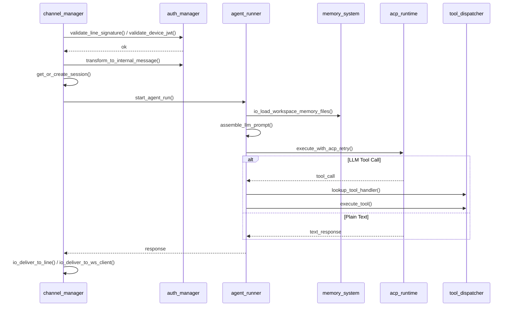

```mermaid
sequenceDiagram
    participant channel_manager
    participant auth_manager
    participant agent_runner
    participant memory_system
    participant acp_runtime
    participant tool_dispatcher

    channel_manager->>auth_manager: validate_line_signature() / validate_device_jwt()
    auth_manager-->>channel_manager: ok
    channel_manager->>auth_manager: transform_to_internal_message()
    channel_manager->>channel_manager: get_or_create_session()
    channel_manager->>agent_runner: start_agent_run()
    agent_runner->>memory_system: io_load_workspace_memory_files()
    agent_runner->>agent_runner: assemble_llm_prompt()
    agent_runner->>acp_runtime: execute_with_acp_retry()
    alt LLM Tool Call
        acp_runtime-->>agent_runner: tool_call
        agent_runner->>tool_dispatcher: lookup_tool_handler()
        agent_runner->>tool_dispatcher: execute_tool()
    else Plain Text
        acp_runtime-->>agent_runner: text_response
    end
    agent_runner-->>channel_manager: response
    channel_manager->>channel_manager: io_deliver_to_line() / io_deliver_to_ws_client()
```
