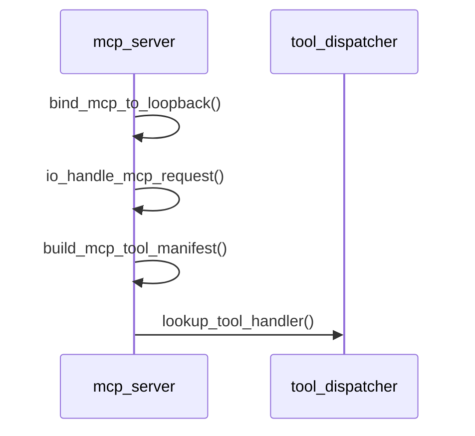

```mermaid
sequenceDiagram
    participant mcp_server
    participant tool_dispatcher
    
    mcp_server->>mcp_server: bind_mcp_to_loopback()
    mcp_server->>mcp_server: io_handle_mcp_request()
    mcp_server->>mcp_server: build_mcp_tool_manifest()
    mcp_server->>tool_dispatcher: lookup_tool_handler()
```
